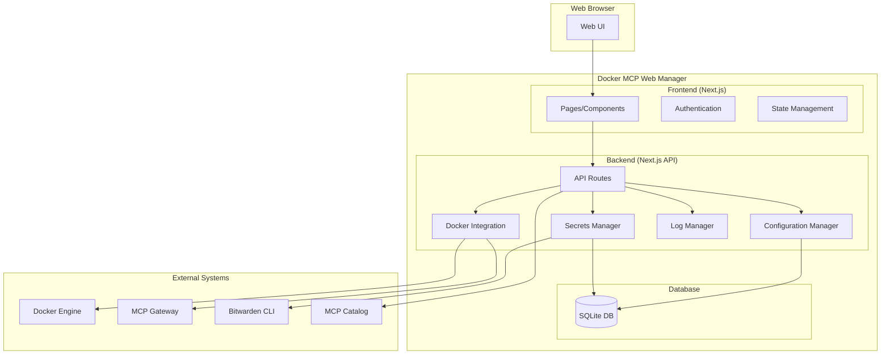

# Design Document

## Overview

The Docker MCP Web Manager is a Next.js-based web application that provides a comprehensive management interface for Docker MCP Gateway. The system integrates with Docker MCP CLI commands and provides a user-friendly web interface for managing MCP servers, configurations, and monitoring.

## Architecture

### System Architecture



### Technology Stack

- **Frontend**: Next.js 14 with TypeScript, Tailwind CSS, React Query
- **Backend**: Next.js API Routes with TypeScript
- **Database**: SQLite for configuration and metadata storage
- **Authentication**: NextAuth.js with custom providers
- **Container**: Docker with multi-stage builds
- **Orchestration**: Docker Compose V2

## Components and Interfaces

### Frontend Components

#### 1. Authentication Components
- **LoginForm**: Handles user authentication
- **AuthProvider**: Manages authentication state
- **ProtectedRoute**: Route protection wrapper

#### 2. Dashboard Components
- **ServerList**: Displays installed MCP servers with status
- **ServerCard**: Individual server information card
- **StatusIndicator**: Visual status representation

#### 3. Server Management Components
- **ServerDetail**: Detailed server information view
- **ConfigurationForm**: Server configuration editor
- **ToolSelector**: Tool selection interface
- **TestRunner**: Tool testing interface

#### 4. Catalog Components
- **CatalogBrowser**: Browse available MCP servers
- **ServerInstaller**: Installation workflow
- **InstallationProgress**: Installation status tracking

#### 5. Monitoring Components
- **LogViewer**: Real-time log display
- **LogFilter**: Log filtering and search
- **MetricsDisplay**: Resource usage metrics

#### 6. Configuration Components
- **ImportExport**: Configuration import/export interface
- **SecretsManager**: Secure credential management
- **BitwardenIntegration**: Bitwarden CLI integration

### Backend API Endpoints

#### 1. Server Management API
```typescript
// GET /api/v1/servers - List all MCP servers
// GET /api/v1/servers/[id] - Get server details
// POST /api/v1/servers/[id]/start - Start server
// POST /api/v1/servers/[id]/stop - Stop server
// PUT /api/v1/servers/[id]/config - Update server configuration
// DELETE /api/v1/servers/[id] - Remove server
```

#### 2. Catalog API
```typescript
// GET /api/v1/catalog - Get available servers from catalog
// GET /api/v1/catalog/[id] - Get server details from catalog
// POST /api/v1/catalog/[id]/install - Install server from catalog
```

#### 3. Testing API
```typescript
// POST /api/v1/servers/[id]/test - Execute tool test
// GET /api/v1/servers/[id]/test-history - Get test history
```

#### 4. Logs API
```typescript
// GET /api/v1/servers/[id]/logs - Get server logs
// GET /api/v1/servers/[id]/logs/stream - Stream logs (SSE)
```

#### 5. Configuration API
```typescript
// GET /api/v1/config/export - Export configuration
// POST /api/v1/config/import - Import configuration
// GET /api/v1/secrets - List secrets (masked)
// POST /api/v1/secrets - Create/update secret
// DELETE /api/v1/secrets/[id] - Delete secret
```

#### 6. Authentication API
```typescript
// POST /api/v1/auth/login - User login
// POST /api/v1/auth/logout - User logout
// GET /api/v1/auth/session - Get current session
```

### Docker Integration Layer

#### DockerMCPClient
```typescript
class DockerMCPClient {
  async listServers(): Promise<MCPServer[]>
  async getServerDetails(id: string): Promise<MCPServerDetail>
  async enableServer(name: string): Promise<void>
  async disableServer(name: string): Promise<void>
  async startGateway(): Promise<void>
  async stopGateway(): Promise<void>
  async getServerLogs(id: string): Promise<string[]>
  async testServerTool(id: string, tool: string, params: any): Promise<any>
}
```

#### CatalogClient
```typescript
class CatalogClient {
  async getCatalog(): Promise<CatalogEntry[]>
  async getServerInfo(name: string): Promise<CatalogServerInfo>
  async installServer(name: string, config: ServerConfig): Promise<void>
}
```

## Data Models

### Core Models

#### MCPServer
```typescript
interface MCPServer {
  id: string
  name: string
  image: string
  status: 'running' | 'stopped' | 'error'
  version: string
  description: string
  tools: Tool[]
  resources: Resource[]
  prompts: Prompt[]
  configuration: ServerConfiguration
  createdAt: Date
  updatedAt: Date
}
```

#### ServerConfiguration
```typescript
interface ServerConfiguration {
  id: string
  serverId: string
  environment: Record<string, string>
  enabledTools: string[]
  secrets: SecretReference[]
  resourceLimits: ResourceLimits
  networkConfig: NetworkConfig
}
```

#### Tool
```typescript
interface Tool {
  name: string
  description: string
  inputSchema: JSONSchema
  enabled: boolean
}
```

#### Secret
```typescript
interface Secret {
  id: string
  name: string
  type: 'api_key' | 'token' | 'password' | 'certificate'
  encrypted: boolean
  bitwardenId?: string
  createdAt: Date
  updatedAt: Date
}
```

#### TestResult
```typescript
interface TestResult {
  id: string
  serverId: string
  toolName: string
  input: any
  output: any
  success: boolean
  error?: string
  executionTime: number
  timestamp: Date
}
```

### Database Schema

#### servers table
```sql
CREATE TABLE servers (
  id TEXT PRIMARY KEY,
  name TEXT NOT NULL UNIQUE,
  image TEXT NOT NULL,
  status TEXT NOT NULL,
  version TEXT,
  description TEXT,
  created_at DATETIME DEFAULT CURRENT_TIMESTAMP,
  updated_at DATETIME DEFAULT CURRENT_TIMESTAMP
);
```

#### configurations table
```sql
CREATE TABLE configurations (
  id TEXT PRIMARY KEY,
  server_id TEXT NOT NULL,
  environment TEXT, -- JSON
  enabled_tools TEXT, -- JSON array
  resource_limits TEXT, -- JSON
  network_config TEXT, -- JSON
  created_at DATETIME DEFAULT CURRENT_TIMESTAMP,
  updated_at DATETIME DEFAULT CURRENT_TIMESTAMP,
  FOREIGN KEY (server_id) REFERENCES servers(id)
);
```

#### secrets table
```sql
CREATE TABLE secrets (
  id TEXT PRIMARY KEY,
  name TEXT NOT NULL UNIQUE,
  type TEXT NOT NULL,
  value TEXT NOT NULL, -- encrypted
  bitwarden_id TEXT,
  created_at DATETIME DEFAULT CURRENT_TIMESTAMP,
  updated_at DATETIME DEFAULT CURRENT_TIMESTAMP
);
```

#### test_results table
```sql
CREATE TABLE test_results (
  id TEXT PRIMARY KEY,
  server_id TEXT NOT NULL,
  tool_name TEXT NOT NULL,
  input TEXT, -- JSON
  output TEXT, -- JSON
  success BOOLEAN NOT NULL,
  error TEXT,
  execution_time INTEGER,
  timestamp DATETIME DEFAULT CURRENT_TIMESTAMP,
  FOREIGN KEY (server_id) REFERENCES servers(id)
);
```

## Error Handling

### Error Categories

1. **Docker Integration Errors**
   - Docker daemon not available
   - MCP Gateway not installed
   - Container execution failures

2. **Authentication Errors**
   - Invalid credentials
   - Session expiration
   - Bitwarden CLI errors

3. **Configuration Errors**
   - Invalid configuration format
   - Missing required fields
   - Encryption/decryption failures

4. **Network Errors**
   - Catalog service unavailable
   - Server communication failures
   - Timeout errors

### Error Response Format
```typescript
interface ErrorResponse {
  error: {
    code: string
    message: string
    details?: any
    requestId: string
    timestamp: string
  }
}
```

#### Standard Error Codes
- `VALIDATION_ERROR` (400) - Request validation failed
- `AUTHENTICATION_REQUIRED` (401) - Authentication required
- `AUTHORIZATION_DENIED` (403) - Insufficient permissions
- `RESOURCE_NOT_FOUND` (404) - Requested resource not found
- `CONFLICT` (409) - Resource conflict (e.g., duplicate name)
- `RATE_LIMIT_EXCEEDED` (429) - Too many requests
- `INTERNAL_ERROR` (500) - Internal server error
- `SERVICE_UNAVAILABLE` (503) - External service unavailable
- `DOCKER_ERROR` (502) - Docker operation failed
- `BITWARDEN_ERROR` (502) - Bitwarden integration failed

#### Error Response Examples
```typescript
// Validation Error (400)
{
  "error": {
    "code": "VALIDATION_ERROR",
    "message": "Invalid request parameters",
    "details": {
      "field": "name",
      "reason": "Name is required and must be at least 3 characters"
    },
    "requestId": "req-123456789",
    "timestamp": "2024-01-01T00:00:00Z"
  }
}

// Resource Not Found (404)
{
  "error": {
    "code": "RESOURCE_NOT_FOUND",
    "message": "Server not found",
    "details": {
      "resource": "server",
      "id": "server-123"
    },
    "requestId": "req-123456789",
    "timestamp": "2024-01-01T00:00:00Z"
  }
}
```
interface ErrorResponse {
  error: {
    code: string
    message: string
    details?: any
    timestamp: string
  }
}
```

### Error Handling Strategy

1. **Frontend Error Handling**
   - Global error boundary for React components
   - Toast notifications for user-facing errors
   - Retry mechanisms for transient failures
   - Graceful degradation for non-critical features

2. **Backend Error Handling**
   - Structured error logging
   - Error categorization and appropriate HTTP status codes
   - Sanitized error messages for security
   - Automatic retry for recoverable operations

## Testing Strategy

### Unit Testing
- **Frontend**: Jest + React Testing Library
- **Backend**: Jest + Supertest
- **Integration**: Docker integration layer testing

### Integration Testing
- Docker MCP CLI integration tests
- Database operation tests
- Authentication flow tests
- API endpoint tests

### End-to-End Testing
- Playwright for full user workflow testing
- Docker Compose test environment
- Automated installation and configuration testing

### Security Testing
- Authentication and authorization testing
- Secret management security validation
- Input validation and sanitization testing
- Container security scanning

### Performance Testing
- Load testing for concurrent users
- Database query performance testing
- Docker operation performance testing
- Memory and resource usage monitoring

## Security Considerations

### Authentication & Authorization
- JWT-based session management
- Role-based access control (future enhancement)
- Secure session storage
- Bitwarden integration for credential management

### Data Protection
- Encryption at rest for sensitive data
- Secure secret storage with AES-256 encryption
- Environment variable protection
- Secure communication with HTTPS

### Container Security
- Non-root user execution
- Minimal base images
- Security scanning integration
- Resource limits and isolation

### Input Validation
- Comprehensive input sanitization
- JSON schema validation
- File upload restrictions
- SQL injection prevention

## Deployment Architecture

### Docker Compose Configuration
```yaml
services:
  web:
    build: .
    ports:
      - "3000:3000"
    environment:
      NODE_ENV: production
      DATABASE_URL: file:./data/app.db
      NEXTAUTH_SECRET: ${NEXTAUTH_SECRET}
      NEXTAUTH_URL: ${NEXTAUTH_URL:-http://localhost:3000}
    volumes:
      - app-data:/app/data
      - /var/run/docker.sock:/var/run/docker.sock:ro
    depends_on:
      db-init:
        condition: service_completed_successfully
    restart: unless-stopped
    healthcheck:
      test: ["CMD", "curl", "-f", "http://localhost:3000/api/health"]
      interval: 30s
      timeout: 10s
      retries: 3
  
  db-init:
    image: alpine:latest
    volumes:
      - app-data:/data
    command: sh -c "mkdir -p /data && chmod 755 /data"
    restart: "no"

volumes:
  app-data:
    driver: local
```

### Environment Configuration
- Development: Hot reload, debug logging
- Production: Optimized builds, structured logging
- Docker socket access for MCP Gateway integration
- Persistent data storage for configuration and logs
#### 7. Job Management API
```typescript
// GET /api/v1/jobs/[jobId] - Get job status and result
// GET /api/v1/jobs - List jobs (with pagination, sort, filter)
// DELETE /api/v1/jobs/[jobId] - Cancel job (if cancellable)
```

### API Request/Response Specifications

#### Query Parameters for List Endpoints
All list endpoints support the following query parameters:

- `page` (number, default: 1) - Page number for pagination
- `limit` (number, default: 20, max: 100) - Number of items per page
- `sort` (string) - Sort field (e.g., "name", "-created_at" for descending)
- `filter` (object) - Filter criteria as JSON object
- `search` (string) - Search term for text fields

Example:
```
GET /api/v1/servers?page=1&limit=10&sort=name&filter={"status":"running"}&search=docker
```

#### Async Operation Response Format
For async operations (install, start, stop, test), the API returns:

```typescript
// HTTP 202 Accepted
{
  "jobId": "uuid-string",
  "status": "pending",
  "message": "Operation started successfully",
  "estimatedDuration": 30000 // milliseconds
}
```

#### Job Status Response Format
```typescript
// GET /api/v1/jobs/[jobId]
{
  "jobId": "uuid-string",
  "status": "completed" | "pending" | "running" | "failed" | "cancelled",
  "type": "install" | "start" | "stop" | "test",
  "target": {
    "type": "server" | "catalog",
    "id": "server-id"
  },
  "progress": {
    "current": 75,
    "total": 100,
    "message": "Installing dependencies..."
  },
  "result": any, // Only present when status is "completed"
  "error": {
    "code": "string",
    "message": "string",
    "details": any
  }, // Only present when status is "failed"
  "createdAt": "2024-01-01T00:00:00Z",
  "updatedAt": "2024-01-01T00:00:00Z",
  "completedAt": "2024-01-01T00:00:00Z" // Only present when completed
}
```


#### Job
```typescript
interface Job {
  id: string
  type: 'install' | 'start' | 'stop' | 'test'
  status: 'pending' | 'running' | 'completed' | 'failed' | 'cancelled'
  target: {
    type: 'server' | 'catalog'
    id: string
  }
  progress: {
    current: number
    total: number
    message: string
  }
  result?: any
  error?: {
    code: string
    message: string
    details: any
  }
  createdAt: Date
  updatedAt: Date
  completedAt?: Date
}
```


#### jobs table
```sql
CREATE TABLE jobs (
  id TEXT PRIMARY KEY,
  type TEXT NOT NULL,
  status TEXT NOT NULL,
  target_type TEXT NOT NULL,
  target_id TEXT NOT NULL,
  progress_current INTEGER DEFAULT 0,
  progress_total INTEGER DEFAULT 100,
  progress_message TEXT,
  result TEXT, -- JSON
  error_code TEXT,
  error_message TEXT,
  error_details TEXT, -- JSON
  created_at DATETIME DEFAULT CURRENT_TIMESTAMP,
  updated_at DATETIME DEFAULT CURRENT_TIMESTAMP,
  completed_at DATETIME
);
```

