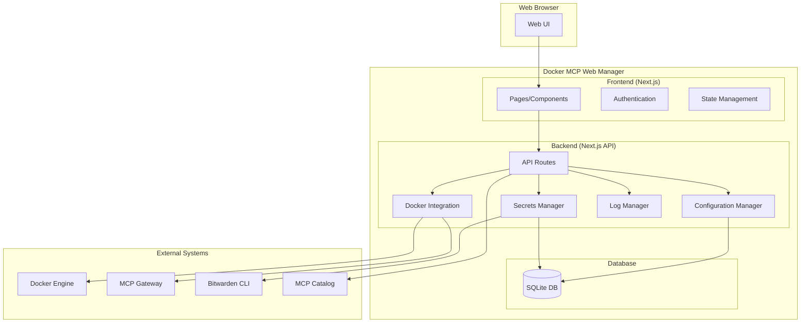

# Design Document

## Overview

The Docker MCP Web Manager is a Next.js-based web application that provides a comprehensive management interface for Docker MCP Gateway. The system integrates with Docker MCP CLI commands and provides a user-friendly web interface for managing MCP servers, configurations, and monitoring.

## Architecture

### System Architecture



### Technology Stack

- **Frontend**: Next.js 14 with TypeScript, Tailwind CSS, React Query
- **Backend**: Next.js API Routes with TypeScript
- **Database**: SQLite for configuration and metadata storage
- **Authentication**: NextAuth.js with custom providers
- **Container**: Docker with multi-stage builds
- **Orchestration**: Docker Compose V2

## Components and Interfaces

### Frontend Components

#### 1. Authentication Components
- **LoginForm**: Handles user authentication
- **AuthProvider**: Manages authentication state
- **ProtectedRoute**: Route protection wrapper

#### 2. Dashboard Components
- **ServerList**: Displays installed MCP servers with status
- **ServerCard**: Individual server information card
- **StatusIndicator**: Visual status representation

#### 3. Server Management Components
- **ServerDetail**: Detailed server information view
- **ConfigurationForm**: Server configuration editor
- **ToolSelector**: Tool selection interface
- **TestRunner**: Tool testing interface

#### 4. Catalog Components
- **CatalogBrowser**: Browse available MCP servers
- **ServerInstaller**: Installation workflow
- **InstallationProgress**: Installation status tracking

#### 5. Monitoring Components
- **LogViewer**: Real-time log display
- **LogFilter**: Log filtering and search
- **MetricsDisplay**: Resource usage metrics

#### 6. Configuration Components
- **ImportExport**: Configuration import/export interface
- **SecretsManager**: Secure credential management
- **BitwardenIntegration**: Bitwarden CLI integration

### Backend API Endpoints

#### 1. Server Management API
```typescript
// GET /api/v1/servers - List all MCP servers
// GET /api/v1/servers/[id] - Get server details
// POST /api/v1/servers/[id]/start - Start server (202 Accepted, returns { jobId })
// POST /api/v1/servers/[id]/stop - Stop server (202 Accepted, returns { jobId })
// PUT /api/v1/servers/[id]/config - Update server configuration
// DELETE /api/v1/servers/[id] - Remove server
```

**Note**: Server start/stop operations are asynchronous and return HTTP 202 with a jobId. See the Job Management API and Job data model below for response format and job status polling.

#### 2. Catalog API

#### Catalog Install API Details
```typescript
// POST /api/v1/catalog/[id]/install - Install server from catalog
// Request Body:
{
  "config": ServerConfiguration
}

// Response (HTTP 202 Accepted):
{
  "jobId": "uuid-string",
  "status": "pending",
  "message": "Server installation started successfully",
  "estimatedDuration": 60000 // milliseconds
}

// Job Status Endpoint:
// GET /api/v1/jobs/[jobId] - Monitor installation progress
// Job type will be "install" with target.type "catalog"
```
```typescript
// GET /api/v1/catalog - Get available servers from catalog
// GET /api/v1/catalog/[id] - Get server details from catalog
// POST /api/v1/catalog/[id]/install - Install server from catalog
```

#### 3. Testing API
```typescript
// POST /api/v1/servers/[id]/test - Execute tool test
// GET /api/v1/servers/[id]/test-history - Get test history
```

#### 4. Logs API
```typescript
// GET /api/v1/servers/[id]/logs - Get server logs
// GET /api/v1/servers/[id]/logs/stream - Stream logs (SSE)
```

#### 5. Configuration API
```typescript
// GET /api/v1/config/export - Export configuration
// POST /api/v1/config/import - Import configuration
// GET /api/v1/secrets - List secrets (masked)
// POST /api/v1/secrets - Create/update secret
// DELETE /api/v1/secrets/[id] - Delete secret
```

#### 6. Authentication API
```typescript
// POST /api/v1/auth/login - User login
// POST /api/v1/auth/logout - User logout
// GET /api/v1/auth/session - Get current session
```

#### 7. Health API
```typescript
// GET /api/health - Liveness/Readiness probe (200 OK when healthy)
```

### Docker Integration Layer

#### DockerMCPClient
```typescript
class DockerMCPClient {
  async listServers(): Promise<MCPServer[]>
  async getServerDetails(id: string): Promise<MCPServer>
  async enableServer(id: string): Promise<JobResponse> // Returns job descriptor for async server enablement
  async disableServer(id: string): Promise<JobResponse> // Returns job descriptor for async server disablement
  async startGateway(): Promise<JobResponse> // Returns job descriptor for async operation
  async stopGateway(): Promise<JobResponse> // Returns job descriptor for async operation
  async getServerLogs(id: string): Promise<string[]>
  async testServerTool(id: string, tool: string, params: any): Promise<JobResponse> // Returns job descriptor for async tool testing
}
```

#### CatalogClient
```typescript
class CatalogClient {
  async getCatalog(): Promise<CatalogEntry[]>
  async getServerInfo(id: string): Promise<CatalogServerInfo>
  async installServer(id: string, config: ServerConfiguration): Promise<JobResponse> // Returns job descriptor

  async getJobStatus(jobId: string): Promise<Job> // Get job status and progress
  async cancelJob(jobId: string): Promise<void> // Cancel job if cancellable
}
```

## Data Models

### Core Models

#### MCPServer
```typescript
interface MCPServer {
  id: string
  name: string
  image: string
  status: 'running' | 'stopped' | 'error'
  version: string
  description: string
  tools: Tool[]
  resources: Resource[]
  prompts: Prompt[]
  configuration: ServerConfiguration
  createdAt: Date
  updatedAt: Date
}
```

#### ServerConfiguration
```typescript
interface ServerConfiguration {
  id: string
  serverId: string
  environment: Record<string, string>
  enabledTools: string[]
  secrets: SecretReference[]
  resourceLimits: ResourceLimits
  networkConfig: NetworkConfig
}
```

#### Tool
```typescript
interface Tool {
  name: string
  description: string
  inputSchema: JSONSchema
  enabled: boolean
}
```


#### Resource
```typescript
interface Resource {
  uri: string
  name: string
  description?: string
  mimeType?: string
  metadata?: Record<string, any>
}
```

#### Prompt
```typescript
interface Prompt {
  name: string
  description?: string
  arguments?: JSONSchema
  metadata?: Record<string, any>
}
```

#### SecretReference
```typescript
interface SecretReference {
  secretId: string
  environmentVariable: string
  required: boolean
}
```

#### ResourceLimits
```typescript
interface ResourceLimits {
  memory?: string // e.g., "512m", "1g"
  cpu?: string // e.g., "0.5", "1"
  disk?: string // e.g., "1g", "10g"
  network?: {
    bandwidth?: string // e.g., "100m", "1g"
    connections?: number
  }
}
```

#### NetworkConfig
```typescript
interface NetworkConfig {
  mode: 'bridge' | 'host' | 'none' | 'overlay'
  ports?: Array<{
    containerPort: number
    hostPort?: number
    protocol: 'tcp' | 'udp'
  }>
  networks?: string[]
  dns?: string[]
  extraHosts?: Array<{
    hostname: string
    ip: string
  }>
}
```

#### JSONSchema
```typescript
interface JSONSchema {
  type: 'object' | 'array' | 'string' | 'number' | 'boolean' | 'null'
  properties?: Record<string, JSONSchema>
  items?: JSONSchema | JSONSchema[]
  required?: string[]
  enum?: any[]
  const?: any
  format?: string
  pattern?: string
  minimum?: number
  maximum?: number
  minLength?: number
  maxLength?: number
  minItems?: number
  maxItems?: number
  additionalProperties?: boolean | JSONSchema
  description?: string
  title?: string
  default?: any
  examples?: any[]
}
```
#### Secret
```typescript
interface Secret {
  id: string
  name: string
  type: 'api_key' | 'token' | 'password' | 'certificate'
  encrypted: boolean
  bitwardenId?: string
  createdAt: Date
  updatedAt: Date
}
```

#### TestResult
```typescript
interface TestResult {
  id: string
  serverId: string
  toolName: string
  input: any
  output: any
  success: boolean
  error?: string
  executionTime: number
  timestamp: Date
}
```

### Database Schema

#### servers table
```sql
CREATE TABLE servers (
  id TEXT PRIMARY KEY,
  name TEXT NOT NULL UNIQUE,
  image TEXT NOT NULL,
  status TEXT NOT NULL CHECK (status IN ('running', 'stopped', 'error')),
  version TEXT,
  description TEXT,
  created_at DATETIME DEFAULT CURRENT_TIMESTAMP,
  updated_at DATETIME DEFAULT CURRENT_TIMESTAMP
);
```

#### configurations table
```sql
CREATE TABLE configurations (
  id TEXT PRIMARY KEY,
  server_id TEXT NOT NULL,
  environment TEXT CHECK(JSON_VALID(environment)), -- JSON with validation
  enabled_tools TEXT CHECK(JSON_VALID(enabled_tools)), -- JSON array with validation
  resource_limits TEXT CHECK(JSON_VALID(resource_limits)), -- JSON with validation
  network_config TEXT CHECK(JSON_VALID(network_config)), -- JSON with validation
  -- Generated columns for indexing JSON paths
  node_env GENERATED ALWAYS AS (json_extract(environment, '$.NODE_ENV')) VIRTUAL,
  enabled_tools_count GENERATED ALWAYS AS (json_array_length(enabled_tools)) VIRTUAL,
  memory_limit GENERATED ALWAYS AS (json_extract(resource_limits, '$.memory')) VIRTUAL,
  representative_port GENERATED ALWAYS AS (
    COALESCE(
      json_extract(network_config, '$.ports[0].hostPort'),
      json_extract(network_config, '$.ports[0].containerPort')
    )
  ) VIRTUAL,
  created_at DATETIME DEFAULT CURRENT_TIMESTAMP,
  updated_at DATETIME DEFAULT CURRENT_TIMESTAMP,
  FOREIGN KEY (server_id) REFERENCES servers(id) ON DELETE CASCADE ON UPDATE CASCADE
);

-- Trigger for updated_at field
CREATE TRIGGER configurations_updated_at
  AFTER UPDATE ON configurations
  FOR EACH ROW WHEN NEW.updated_at = OLD.updated_at
BEGIN
  UPDATE configurations SET updated_at = CURRENT_TIMESTAMP WHERE id = NEW.id;
END;

-- Indexes for performance optimization
CREATE INDEX idx_configurations_server_id ON configurations(server_id);
-- Generated column indexes for efficient JSON querying
CREATE INDEX idx_configurations_node_env ON configurations(node_env);
CREATE INDEX idx_configurations_enabled_tools_count ON configurations(enabled_tools_count);
CREATE INDEX idx_configurations_memory_limit ON configurations(memory_limit);
CREATE INDEX idx_configurations_representative_port ON configurations(representative_port);
```

#### secret_references table
```sql
CREATE TABLE secret_references (
  id TEXT PRIMARY KEY,
  configuration_id TEXT NOT NULL,
  secret_id TEXT NOT NULL,
  environment_variable TEXT NOT NULL,
  required BOOLEAN DEFAULT FALSE,
  created_at DATETIME DEFAULT CURRENT_TIMESTAMP,
  updated_at DATETIME DEFAULT CURRENT_TIMESTAMP,
  FOREIGN KEY (configuration_id) REFERENCES configurations(id) ON DELETE CASCADE ON UPDATE CASCADE,
  FOREIGN KEY (secret_id) REFERENCES secrets(id) ON DELETE CASCADE ON UPDATE CASCADE,
  UNIQUE(configuration_id, environment_variable)
);

-- Trigger for updated_at field
CREATE TRIGGER secret_references_updated_at
  AFTER UPDATE ON secret_references
  FOR EACH ROW WHEN NEW.updated_at = OLD.updated_at
BEGIN
  UPDATE secret_references SET updated_at = CURRENT_TIMESTAMP WHERE id = NEW.id;
END;
```

#### resources table
```sql
CREATE TABLE resources (
  id TEXT PRIMARY KEY,
  server_id TEXT NOT NULL,
  uri TEXT NOT NULL,
  name TEXT NOT NULL,
  description TEXT,
  mime_type TEXT,
  metadata TEXT CHECK(JSON_VALID(metadata)), -- JSON with validation
  created_at DATETIME DEFAULT CURRENT_TIMESTAMP,
  updated_at DATETIME DEFAULT CURRENT_TIMESTAMP,
  FOREIGN KEY (server_id) REFERENCES servers(id) ON DELETE CASCADE ON UPDATE CASCADE,
  UNIQUE(server_id, uri)
);

-- Trigger for updated_at field
CREATE TRIGGER resources_updated_at
  AFTER UPDATE ON resources
  FOR EACH ROW WHEN NEW.updated_at = OLD.updated_at
BEGIN
  UPDATE resources SET updated_at = CURRENT_TIMESTAMP WHERE id = NEW.id;
END;
```

#### prompts table
```sql
CREATE TABLE prompts (
  id TEXT PRIMARY KEY,
  server_id TEXT NOT NULL,
  name TEXT NOT NULL,
  description TEXT,
  arguments TEXT CHECK(JSON_VALID(arguments)), -- JSON (JSONSchema) with validation
  metadata TEXT CHECK(JSON_VALID(metadata)), -- JSON with validation
  created_at DATETIME DEFAULT CURRENT_TIMESTAMP,
  updated_at DATETIME DEFAULT CURRENT_TIMESTAMP,
  FOREIGN KEY (server_id) REFERENCES servers(id) ON DELETE CASCADE ON UPDATE CASCADE,
  UNIQUE(server_id, name)
);

-- Trigger for updated_at field
CREATE TRIGGER prompts_updated_at
  AFTER UPDATE ON prompts
  FOR EACH ROW WHEN NEW.updated_at = OLD.updated_at
BEGIN
  UPDATE prompts SET updated_at = CURRENT_TIMESTAMP WHERE id = NEW.id;
END;
```

#### tools table
```sql
CREATE TABLE tools (
  id TEXT PRIMARY KEY,
  server_id TEXT NOT NULL,
  name TEXT NOT NULL,
  description TEXT,
  input_schema TEXT NOT NULL CHECK(JSON_VALID(input_schema)), -- JSON (JSONSchema) with validation
  enabled BOOLEAN DEFAULT TRUE,
  created_at DATETIME DEFAULT CURRENT_TIMESTAMP,
  updated_at DATETIME DEFAULT CURRENT_TIMESTAMP,
  FOREIGN KEY (server_id) REFERENCES servers(id) ON DELETE CASCADE ON UPDATE CASCADE,
  UNIQUE(server_id, name)
);

-- Trigger for updated_at field
CREATE TRIGGER tools_updated_at
  AFTER UPDATE ON tools
  FOR EACH ROW WHEN NEW.updated_at = OLD.updated_at
BEGIN
  UPDATE tools SET updated_at = CURRENT_TIMESTAMP WHERE id = NEW.id;
END;
```

#### bitwarden_items table
```sql
-- Bitwarden統合テーブル（外部キー参照の整合性確保）
CREATE TABLE bitwarden_items (
  id TEXT PRIMARY KEY,
  item_id TEXT NOT NULL UNIQUE, -- BitwardenのアイテムID
  name TEXT NOT NULL,
  type TEXT NOT NULL, -- 'login', 'secure_note', 'card', 'identity'
  folder_id TEXT,
  organization_id TEXT,
  created_at DATETIME DEFAULT CURRENT_TIMESTAMP,
  updated_at DATETIME DEFAULT CURRENT_TIMESTAMP
);

-- Trigger for updated_at field
CREATE TRIGGER bitwarden_items_updated_at
  AFTER UPDATE ON bitwarden_items
  FOR EACH ROW WHEN NEW.updated_at = OLD.updated_at
BEGIN
  UPDATE bitwarden_items SET updated_at = CURRENT_TIMESTAMP WHERE id = NEW.id;
END;
```

#### secrets table
```sql
-- セキュリティ強化されたsecretsテーブル
CREATE TABLE secrets (
  id TEXT PRIMARY KEY,
  name TEXT NOT NULL UNIQUE,
  type TEXT NOT NULL CHECK (type IN ('api_key', 'token', 'password', 'certificate')),
  -- AEAD暗号化コンポーネントを分離して格納（セキュリティファースト設計）
  ciphertext BLOB NOT NULL, -- 暗号化されたデータ
  iv BLOB NOT NULL,         -- 初期化ベクトル（12-16バイト）
  tag BLOB NOT NULL,        -- 認証タグ（16バイト）
  alg TEXT NOT NULL DEFAULT 'AES-256-GCM', -- 使用した暗号化アルゴリズム
  bitwarden_item_id TEXT,   -- 外部キー参照（Bitwardenテーブルへの適切な参照）
  created_at DATETIME DEFAULT CURRENT_TIMESTAMP,
  updated_at DATETIME DEFAULT CURRENT_TIMESTAMP,
  FOREIGN KEY (bitwarden_item_id) REFERENCES bitwarden_items(id) ON DELETE SET NULL
);

-- Trigger for updated_at field
CREATE TRIGGER secrets_updated_at
  AFTER UPDATE ON secrets
  FOR EACH ROW WHEN NEW.updated_at = OLD.updated_at
BEGIN
  UPDATE secrets SET updated_at = CURRENT_TIMESTAMP WHERE id = NEW.id;
END;
```

### Database Initialization

Before creating tables, ensure foreign key constraints are enabled:

```sql
-- Enable foreign key constraints
PRAGMA foreign_keys = ON;
```

This must be executed at the beginning of every database connection and migration script.

### Drizzle Configuration

The following `drizzle.config.ts` configuration ensures consistent paths for migrations and database:

```typescript
import { defineConfig } from "drizzle-kit";

export default defineConfig({
  schema: "./src/db/schema.ts",
  out: "/app/data/out/migrations",
  driver: "better-sqlite",
  dbCredentials: {
    url: "file:./app.db"
  },
  verbose: true,
  strict: true
});
```

**Key Configuration Points:**
- **Migrations Output**: `/app/data/out/migrations` (consistent with Docker volume mount)
- **Database URL**: `file:./app.db` (relative to `/app/data` working directory)
- **Schema Location**: `./src/db/schema.ts` (project schema definitions)
- **Driver**: `better-sqlite` (SQLite with enhanced performance)

This configuration ensures all database operations use the same `/app/data` path as the Docker volume mount.

### New Tables to Create

The following new tables need to be created to support the complete data model:

1. **secret_references** - Links configurations to secrets with environment variable mapping
2. **resources** - Stores MCP server resources (files, data sources, etc.)
3. **prompts** - Stores MCP server prompts with argument schemas
4. **tools** - Stores MCP server tools with input schemas

### Migration Script

```sql
-- Create secret_references table
CREATE TABLE secret_references (
  id TEXT PRIMARY KEY,
  configuration_id TEXT NOT NULL,
  secret_id TEXT NOT NULL,
  environment_variable TEXT NOT NULL,
  required BOOLEAN DEFAULT FALSE,
  created_at DATETIME DEFAULT CURRENT_TIMESTAMP,
  updated_at DATETIME DEFAULT CURRENT_TIMESTAMP,
  FOREIGN KEY (configuration_id) REFERENCES configurations(id) ON DELETE CASCADE ON UPDATE CASCADE,
  FOREIGN KEY (secret_id) REFERENCES secrets(id) ON DELETE CASCADE ON UPDATE CASCADE,
  UNIQUE(configuration_id, environment_variable)
);

-- Create resources table
CREATE TABLE resources (
  id TEXT PRIMARY KEY,
  server_id TEXT NOT NULL,
  uri TEXT NOT NULL,
  name TEXT NOT NULL,
  description TEXT,
  mime_type TEXT,
  metadata TEXT CHECK(JSON_VALID(metadata)), -- JSON with validation
  created_at DATETIME DEFAULT CURRENT_TIMESTAMP,
  updated_at DATETIME DEFAULT CURRENT_TIMESTAMP,
  FOREIGN KEY (server_id) REFERENCES servers(id) ON DELETE CASCADE ON UPDATE CASCADE,
  UNIQUE(server_id, uri)
);

-- Create prompts table
CREATE TABLE prompts (
  id TEXT PRIMARY KEY,
  server_id TEXT NOT NULL,
  name TEXT NOT NULL,
  description TEXT,
  arguments TEXT CHECK(JSON_VALID(arguments)), -- JSON (JSONSchema) with validation
  metadata TEXT CHECK(JSON_VALID(metadata)), -- JSON with validation
  created_at DATETIME DEFAULT CURRENT_TIMESTAMP,
  updated_at DATETIME DEFAULT CURRENT_TIMESTAMP,
  FOREIGN KEY (server_id) REFERENCES servers(id) ON DELETE CASCADE ON UPDATE CASCADE,
  UNIQUE(server_id, name)
);

-- Create tools table
CREATE TABLE tools (
  id TEXT PRIMARY KEY,
  server_id TEXT NOT NULL,
  name TEXT NOT NULL,
  description TEXT,
  input_schema TEXT NOT NULL CHECK(JSON_VALID(input_schema)), -- JSON (JSONSchema) with validation
  enabled BOOLEAN DEFAULT TRUE,
  created_at DATETIME DEFAULT CURRENT_TIMESTAMP,
  updated_at DATETIME DEFAULT CURRENT_TIMESTAMP,
  FOREIGN KEY (server_id) REFERENCES servers(id) ON DELETE CASCADE ON UPDATE CASCADE,
  UNIQUE(server_id, name)
);

-- Create indexes for better performance
CREATE INDEX idx_secret_references_configuration_id ON secret_references(configuration_id);
CREATE INDEX idx_secret_references_secret_id ON secret_references(secret_id);

-- Bitwarden統合テーブルのインデックス
CREATE INDEX idx_bitwarden_items_item_id ON bitwarden_items(item_id);
CREATE INDEX idx_bitwarden_items_name ON bitwarden_items(name);
CREATE INDEX idx_bitwarden_items_type ON bitwarden_items(type);
CREATE INDEX idx_bitwarden_items_folder_id ON bitwarden_items(folder_id);

-- セキュリティ強化されたsecretsテーブルのインデックス
CREATE INDEX idx_secrets_name ON secrets(name);
CREATE INDEX idx_secrets_type ON secrets(type);
CREATE INDEX idx_secrets_bitwarden_item_id ON secrets(bitwarden_item_id);
CREATE INDEX idx_secrets_alg ON secrets(alg); -- 暗号化アルゴリズム別検索用

-- セキュリティ改善: AEAD暗号化コンポーネントの分離
-- 1. ciphertext, iv, tag, algを分離して格納することで、バイナリデータとアルゴリズムメタデータを適切に保持
-- 2. BLOB型を使用することで、暗号化データの整合性を保証
-- 3. 検索用インデックスを追加してパフォーマンスを向上
-- 4. 外部キー参照の整合性を文書化
CREATE INDEX idx_resources_server_id ON resources(server_id);
CREATE INDEX idx_prompts_server_id ON prompts(server_id);
CREATE INDEX idx_tools_server_id ON tools(server_id);
CREATE INDEX idx_tools_enabled ON tools(enabled);
```

| Interface Field | Database Table.Column | Notes |
|----------------|---------------------|-------|
| MCPServer.resources | resources.* | One-to-many relationship |
| MCPServer.prompts | prompts.* | One-to-many relationship |
| MCPServer.tools | tools.* | One-to-many relationship |
| ServerConfiguration.secrets | secret_references.* | Many-to-many via junction table |
| ServerConfiguration.resourceLimits | configurations.resource_limits | JSON field |
| ServerConfiguration.networkConfig | configurations.network_config | JSON field |
| Tool.inputSchema | tools.input_schema | JSON field |
| Prompt.arguments | prompts.arguments | JSON field |
| Resource.metadata | resources.metadata | JSON field |
| Prompt.metadata | prompts.metadata | JSON field |

#### Embedded vs Normalized Data

- **Embedded (JSON)**: ResourceLimits, NetworkConfig, JSONSchema objects
- **Normalized (Separate Tables)**: Resources, Prompts, Tools, SecretReferences

This approach balances query performance with data integrity and flexibility.
```sql
CREATE TABLE test_results (
  id TEXT PRIMARY KEY,
  server_id TEXT NOT NULL,
  tool_name TEXT NOT NULL,
  input TEXT CHECK (input IS NULL OR JSON_VALID(input)), -- JSON with validation
  output TEXT CHECK (output IS NULL OR JSON_VALID(output)), -- JSON with validation
  success BOOLEAN NOT NULL,
  error TEXT,
  execution_time INTEGER,
  timestamp DATETIME DEFAULT CURRENT_TIMESTAMP,
  FOREIGN KEY (server_id) REFERENCES servers(id) ON DELETE CASCADE ON UPDATE CASCADE
);
```

## Error Handling

### Error Categories

1. **Docker Integration Errors**
   - Docker daemon not available
   - MCP Gateway not installed
   - Container execution failures

2. **Authentication Errors**
   - Invalid credentials
   - Session expiration
   - Bitwarden CLI errors

3. **Configuration Errors**
   - Invalid configuration format
   - Missing required fields
   - Encryption/decryption failures

4. **Network Errors**
   - Catalog service unavailable
   - Server communication failures
   - Timeout errors

### Error Response Format
```typescript
interface ErrorResponse {
  error: {
    code: string
    message: string
    details?: any
    requestId: string
    timestamp: string
  }
}
```

#### Standard Error Codes
- `VALIDATION_ERROR` (400) - Request validation failed
- `AUTHENTICATION_REQUIRED` (401) - Authentication required
- `AUTHORIZATION_DENIED` (403) - Insufficient permissions
- `RESOURCE_NOT_FOUND` (404) - Requested resource not found
- `CONFLICT` (409) - Resource conflict (e.g., duplicate name)
- `RATE_LIMIT_EXCEEDED` (429) - Too many requests
- `INTERNAL_ERROR` (500) - Internal server error
- `SERVICE_UNAVAILABLE` (503) - External service unavailable
- `DOCKER_ERROR` (502) - Docker operation failed
- `BITWARDEN_ERROR` (502) - Bitwarden integration failed

#### Error Response Examples
```typescript
// Validation Error (400)
{
  "error": {
    "code": "VALIDATION_ERROR",
    "message": "Invalid request parameters",
    "details": {
      "field": "name",
      "reason": "Name is required and must be at least 3 characters"
    },
    "requestId": "req-123456789",
    "timestamp": "2024-01-01T00:00:00Z"
  }
}

// Resource Not Found (404)
{
  "error": {
    "code": "RESOURCE_NOT_FOUND",
    "message": "Server not found",
    "details": {
      "resource": "server",
      "id": "server-123"
    },
    "requestId": "req-123456789",
    "timestamp": "2024-01-01T00:00:00Z"
  }
}
```

### Error Handling Strategy

1. **Frontend Error Handling**
   - Global error boundary for React components
   - Toast notifications for user-facing errors
   - Retry mechanisms for transient failures
   - Graceful degradation for non-critical features

2. **Backend Error Handling**
   - Structured error logging
   - Error categorization and appropriate HTTP status codes
   - Sanitized error messages for security
   - Automatic retry for recoverable operations

## Testing Strategy

### Unit Testing
- **Frontend**: Jest + React Testing Library
- **Backend**: Jest + Supertest
- **Integration**: Docker integration layer testing

### Integration Testing
- Docker MCP CLI integration tests
- Database operation tests
- Authentication flow tests
- API endpoint tests

### End-to-End Testing
- Playwright for full user workflow testing
- Docker Compose test environment
- Automated installation and configuration testing

### Security Testing
- Authentication and authorization testing
- Secret management security validation
- Input validation and sanitization testing
- Container security scanning

### Performance Testing
- Load testing for concurrent users
- Database query performance testing
- Docker operation performance testing
- Memory and resource usage monitoring

## Security Considerations

### Authentication & Authorization
- JWT-based session management
- Role-based access control (future enhancement)
- Secure session storage
- Bitwarden integration for credential management

### Data Protection

### Database Security Enhancements

#### AEAD Encryption Component Separation
- **Problem**: Storing AEAD ciphertext in a single TEXT column is unsafe and inefficient
- **Solution**: Separated AEAD components into dedicated columns:
  - `ciphertext BLOB`: Encrypted data (binary-safe)
  - `iv BLOB`: Initialization vector (12-16 bytes)
  - `tag BLOB`: Authentication tag (16 bytes)
  - `alg TEXT`: Encryption algorithm metadata
- **Benefits**:
  - Preserves binary data integrity
  - Enables proper decryption with algorithm metadata
  - Prevents data corruption during storage/retrieval

#### Referential Integrity for External References
- **Problem**: Loose `bitwarden_id TEXT` without proper foreign key constraints
- **Solution**: Created dedicated `bitwarden_items` table with proper foreign key relationships
- **Implementation**:
  - `bitwarden_items` table stores Bitwarden item metadata
  - `secrets.bitwarden_item_id` references `bitwarden_items.id`
  - `ON DELETE SET NULL` ensures graceful handling of deleted Bitwarden items

#### Performance Optimization
- **Search Indexes**: Added comprehensive indexes for efficient querying:
  - `idx_secrets_name`: Fast name-based lookups
  - `idx_secrets_type`: Type-based filtering
  - `idx_secrets_bitwarden_item_id`: Foreign key relationship queries
  - `idx_secrets_alg`: Algorithm-based searches
- **Bitwarden Integration Indexes**:
  - `idx_bitwarden_items_item_id`: Fast Bitwarden item lookups
  - `idx_bitwarden_items_name`: Name-based searches
  - `idx_bitwarden_items_type`: Type filtering
  - `idx_bitwarden_items_folder_id`: Folder organization queries

#### Data Validation and Constraints
- **Type Validation**: `CHECK (type IN ('api_key', 'token', 'password', 'certificate'))`
- **Algorithm Defaults**: `DEFAULT 'AES-256-GCM'` for consistent encryption
- **Binary Data Integrity**: BLOB columns ensure proper handling of encrypted data

- Encryption at rest for sensitive data
- Secure secret storage with AES-256 encryption
- Environment variable protection
- Secure communication with HTTPS

### Container Security
- Non-root user execution
- Minimal base images
- Security scanning integration
- Resource limits and isolation

### Input Validation
- Comprehensive input sanitization
- JSON schema validation
- File upload restrictions
- SQL injection prevention

## Deployment Architecture

### Docker Compose Configuration
```yaml
services:
  web:
    build: .
    ports:
      - "3000:3000"
    environment:
      NODE_ENV: production
      DATABASE_URL: file:./app.db
      NEXTAUTH_SECRET: ${NEXTAUTH_SECRET}
      NEXTAUTH_URL: ${NEXTAUTH_URL:-http://localhost:3000}
    volumes:
      - app-data:/app/data
      - /var/run/docker.sock:/var/run/docker.sock:ro
    depends_on:
      db-migrate:
        condition: service_completed_successfully
    restart: unless-stopped
    user: "1000:1000"
    security_opt:
      - no-new-privileges:true
    cap_drop:
      - ALL
    cap_add:
      - NET_BIND_SERVICE
    healthcheck:
      test: ["CMD", "node", "-e", "require('http').get('http://localhost:3000/api/health', (res) => process.exit(res.statusCode === 200 ? 0 : 1)).on('error', () => process.exit(1))"]
      interval: 30s
      timeout: 10s
      retries: 3
      start_period: 40s

  db-migrate:
    build: .
    volumes:
      - app-data:/app/data
    command: sh -c "mkdir -p /app/data && chmod 755 /app/data && npx drizzle-kit migrate"
    restart: "no"
    user: "1000:1000"
    security_opt:
      - no-new-privileges:true
    cap_drop:
      - ALL

volumes:
  app-data:
    driver: local
```
### Security Improvements
- **Non-root execution**: All services run as user 1000:1000 instead of root
- **Capability restrictions**: Dropped ALL capabilities and only added NET_BIND_SERVICE for web service
- **No new privileges**: Prevented privilege escalation attacks
- **Database migrations**: db-migrate service handles both directory creation and database migrations
- **Internal health check**: Uses Node.js built-in HTTP module instead of external curl dependency
- **Read-only Docker socket**: Docker socket remains read-only for security
- **Service readiness**: Health check includes start_period to ensure service is ready before checking


### Environment Configuration
- Development: Hot reload, debug logging
- Production: Optimized builds, structured logging
- Docker socket access for MCP Gateway integration
- Persistent data storage for configuration and logs
#### 7. Job Management API
```typescript
// GET /api/v1/jobs/[jobId] - Get job status and result
// GET /api/v1/jobs - List jobs (with pagination, sort, filter)
// DELETE /api/v1/jobs/[jobId] - Cancel job (if cancellable)
```

### API Request/Response Specifications

#### Query Parameters for List Endpoints
All list endpoints support the following query parameters:

- `page` (number, default: 1) - Page number for pagination
- `limit` (number, default: 20, max: 100) - Number of items per page
- `sort` (string) - Sort field (e.g., "name", "-created_at" for descending)
- `filter` (object) - Filter criteria as JSON object
- `search` (string) - Search term for text fields

Example:
```
GET /api/v1/servers?page=1&limit=10&sort=name&filter={"status":"running"}&search=docker
```

#### Async Operation Response Format
For async operations (install, start, stop, test), the API returns:

```typescript
// HTTP 202 Accepted
{
  "jobId": "uuid-string",
  "status": "pending",
  "message": "Operation started successfully",
  "estimatedDuration": 30000 // milliseconds
}
```

#### Job Status Response Format
```typescript
// GET /api/v1/jobs/[jobId]
{
  "jobId": "uuid-string",
  "status": "completed" | "pending" | "running" | "failed" | "cancelled",
  "type": "install" | "start" | "stop" | "test" | "enable" | "disable",
  "target": {
    "type": "server" | "catalog" | "gateway",
    "id": "server-id"
  },
  "progress": {
    "current": 75,
    "total": 100,
    "message": "Installing dependencies..."
  },
  "result": any, // Only present when status is "completed"
  "error": {
    "code": "string",
    "message": "string",
    "details": any
  }, // Only present when status is "failed"
  "createdAt": "2024-01-01T00:00:00Z",
  "updatedAt": "2024-01-01T00:00:00Z",
  "completedAt": "2024-01-01T00:00:00Z" // Only present when completed
}
```


#### Job
```typescript
interface Job {
  id: string
  type: 'install' | 'start' | 'stop' | 'test' | 'enable' | 'disable' | 'gateway'
  status: 'pending' | 'running' | 'completed' | 'failed' | 'cancelled'
  target: {
    type: 'server' | 'catalog' | 'gateway'
    id: string
  }
  progress: {
    current: number
    total: number
    message: string
  }
  result?: any
  error?: {
    code: string
    message: string
    details: any
  }
  createdAt: Date
  updatedAt: Date
  completedAt?: Date
}

#### JobResponse
```typescript
interface JobResponse {
  jobId: string
  status: 'pending' | 'running' | 'completed' | 'failed' | 'cancelled'
  message?: string
  estimatedDuration?: number
}
```


#### jobs table
```sql
CREATE TABLE jobs (
  id TEXT PRIMARY KEY,
  type TEXT NOT NULL CHECK (type IN ('install', 'start', 'stop', 'test', 'enable', 'disable', 'gateway')),
  status TEXT NOT NULL CHECK (status IN ('pending', 'running', 'completed', 'failed', 'cancelled')),
  target_type TEXT NOT NULL CHECK (target_type IN ('server', 'catalog', 'gateway')),
  target_id TEXT NOT NULL,
  progress_current INTEGER DEFAULT 0,
  progress_total INTEGER DEFAULT 100,
  progress_message TEXT,
  result TEXT CHECK (result IS NULL OR JSON_VALID(result)), -- JSON with validation
  error_code TEXT,
  error_message TEXT,
  error_details TEXT CHECK (error_details IS NULL OR JSON_VALID(error_details)), -- JSON with validation
  created_at DATETIME DEFAULT CURRENT_TIMESTAMP,
  updated_at DATETIME DEFAULT CURRENT_TIMESTAMP,
  completed_at DATETIME
);

-- Trigger for updated_at field
CREATE TRIGGER jobs_updated_at
  AFTER UPDATE ON jobs
  FOR EACH ROW WHEN NEW.updated_at = OLD.updated_at
BEGIN
  UPDATE jobs SET updated_at = CURRENT_TIMESTAMP WHERE id = NEW.id;
END;

-- Operational indexes for runtime queries
CREATE INDEX idx_jobs_target_latest ON jobs(target_type, target_id, created_at DESC); -- Latest job for a target
CREATE INDEX idx_jobs_in_progress ON jobs(status, updated_at) WHERE status IN ('pending', 'running'); -- In-progress jobs
CREATE INDEX idx_jobs_target_status ON jobs(target_type, target_id, status, created_at DESC); -- Target and status queries
```

