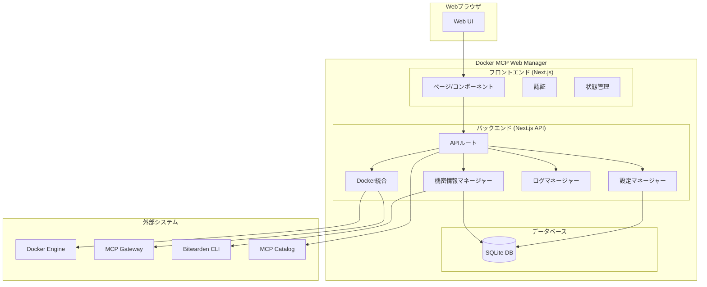

# 設計書

## 概要

Docker MCP Web ManagerはNext.jsベースのWebアプリケーションで、Docker MCP Gatewayの包括的な管理インターフェースを提供します。システムはDocker MCP CLIコマンドと統合し、MCPサーバー、設定、監視のためのユーザーフレンドリーなWebインターフェースを提供します。

## アーキテクチャ

### システムアーキテクチャ



### 技術スタック

- **フロントエンド**: Next.js 14 with TypeScript, Tailwind CSS, React Query
- **バックエンド**: Next.js API Routes with TypeScript
- **データベース**: 設定とメタデータ保存用SQLite
- **認証**: NextAuth.js with custom providers
- **コンテナ**: Docker with multi-stage builds
- **オーケストレーション**: Docker Compose V2

## コンポーネントとインターフェース

### フロントエンドコンポーネント

#### 1. 認証コンポーネント
- **LoginForm**: ユーザー認証処理
- **AuthProvider**: 認証状態管理
- **ProtectedRoute**: ルート保護ラッパー

#### 2. ダッシュボードコンポーネント
- **ServerList**: インストール済みMCPサーバーをステータス付きで表示
- **ServerCard**: 個別サーバー情報カード
- **StatusIndicator**: 視覚的ステータス表現

#### 3. サーバー管理コンポーネント
- **ServerDetail**: 詳細サーバー情報ビュー
- **ConfigurationForm**: サーバー設定エディター
- **ToolSelector**: ツール選択インターフェース
- **TestRunner**: ツールテストインターフェース

#### 4. カタログコンポーネント
- **CatalogBrowser**: 利用可能なMCPサーバーの閲覧
- **ServerInstaller**: インストールワークフロー
- **InstallationProgress**: インストール状況追跡

#### 5. 監視コンポーネント
- **LogViewer**: リアルタイムログ表示
- **LogFilter**: ログフィルタリングと検索
- **MetricsDisplay**: リソース使用状況メトリクス

#### 6. 設定コンポーネント
- **ImportExport**: 設定インポート/エクスポートインターフェース
- **SecretsManager**: 安全な認証情報管理
- **BitwardenIntegration**: Bitwarden CLI統合

### バックエンドAPIエンドポイント

#### 1. サーバー管理API
```typescript
// GET /api/servers - 全MCPサーバーのリスト
// GET /api/servers/[id] - サーバー詳細取得
// POST /api/servers/[id]/start - サーバー開始
// POST /api/servers/[id]/stop - サーバー停止
// PUT /api/servers/[id]/config - サーバー設定更新
// DELETE /api/servers/[id] - サーバー削除
```

#### 2. カタログAPI
```typescript
// GET /api/catalog - カタログから利用可能なサーバー取得
// GET /api/catalog/[id] - カタログからサーバー詳細取得
// POST /api/catalog/[id]/install - カタログからサーバーインストール
```

#### 3. テストAPI
```typescript
// POST /api/servers/[id]/test - ツールテスト実行
// GET /api/servers/[id]/test-history - テスト履歴取得
```

#### 4. ログAPI
```typescript
// GET /api/servers/[id]/logs - サーバーログ取得
// GET /api/servers/[id]/logs/stream - ログストリーム (SSE)
```

#### 5. 設定API
```typescript
// GET /api/config/export - 設定エクスポート
// POST /api/config/import - 設定インポート
// GET /api/secrets - 機密情報リスト（マスク済み）
// POST /api/secrets - 機密情報作成/更新
// DELETE /api/secrets/[id] - 機密情報削除
```

#### 6. 認証API
```typescript
// POST /api/auth/login - ユーザーログイン
// POST /api/auth/logout - ユーザーログアウト
// GET /api/auth/session - 現在のセッション取得
```

### Docker統合レイヤー

#### DockerMCPClient
```typescript
class DockerMCPClient {
  async listServers(): Promise<MCPServer[]>
  async getServerDetails(id: string): Promise<MCPServerDetail>
  async enableServer(name: string): Promise<void>
  async disableServer(name: string): Promise<void>
  async startGateway(): Promise<void>
  async stopGateway(): Promise<void>
  async getServerLogs(id: string): Promise<string[]>
  async testServerTool(id: string, tool: string, params: any): Promise<any>
}
```

#### CatalogClient
```typescript
class CatalogClient {
  async getCatalog(): Promise<CatalogEntry[]>
  async getServerInfo(name: string): Promise<CatalogServerInfo>
  async installServer(name: string, config: ServerConfig): Promise<void>
}
```

## データモデル

### コアモデル

#### MCPServer
```typescript
interface MCPServer {
  id: string
  name: string
  image: string
  status: 'running' | 'stopped' | 'error'
  version: string
  description: string
  tools: Tool[]
  resources: Resource[]
  prompts: Prompt[]
  configuration: ServerConfiguration
  createdAt: Date
  updatedAt: Date
}
```

#### ServerConfiguration
```typescript
interface ServerConfiguration {
  id: string
  serverId: string
  environment: Record<string, string>
  enabledTools: string[]
  secrets: SecretReference[]
  resourceLimits: ResourceLimits
  networkConfig: NetworkConfig
}
```

#### Tool
```typescript
interface Tool {
  name: string
  description: string
  inputSchema: JSONSchema
  enabled: boolean
}
```

#### Secret
```typescript
interface Secret {
  id: string
  name: string
  type: 'api_key' | 'token' | 'password' | 'certificate'
  encrypted: boolean
  bitwardenId?: string
  createdAt: Date
  updatedAt: Date
}
```

#### TestResult
```typescript
interface TestResult {
  id: string
  serverId: string
  toolName: string
  input: any
  output: any
  success: boolean
  error?: string
  executionTime: number
  timestamp: Date
}
```

### データベーススキーマ

#### serversテーブル
```sql
CREATE TABLE servers (
  id TEXT PRIMARY KEY,
  name TEXT NOT NULL UNIQUE,
  image TEXT NOT NULL,
  status TEXT NOT NULL,
  version TEXT,
  description TEXT,
  created_at DATETIME DEFAULT CURRENT_TIMESTAMP,
  updated_at DATETIME DEFAULT CURRENT_TIMESTAMP
);
```

#### configurationsテーブル
```sql
CREATE TABLE configurations (
  id TEXT PRIMARY KEY,
  server_id TEXT NOT NULL,
  environment TEXT, -- JSON
  enabled_tools TEXT, -- JSON array
  resource_limits TEXT, -- JSON
  network_config TEXT, -- JSON
  created_at DATETIME DEFAULT CURRENT_TIMESTAMP,
  updated_at DATETIME DEFAULT CURRENT_TIMESTAMP,
  FOREIGN KEY (server_id) REFERENCES servers(id)
);
```

#### secretsテーブル
```sql
CREATE TABLE secrets (
  id TEXT PRIMARY KEY,
  name TEXT NOT NULL UNIQUE,
  type TEXT NOT NULL,
  value TEXT NOT NULL, -- encrypted
  bitwarden_id TEXT,
  created_at DATETIME DEFAULT CURRENT_TIMESTAMP,
  updated_at DATETIME DEFAULT CURRENT_TIMESTAMP
);
```

#### test_resultsテーブル
```sql
CREATE TABLE test_results (
  id TEXT PRIMARY KEY,
  server_id TEXT NOT NULL,
  tool_name TEXT NOT NULL,
  input TEXT, -- JSON
  output TEXT, -- JSON
  success BOOLEAN NOT NULL,
  error TEXT,
  execution_time INTEGER,
  timestamp DATETIME DEFAULT CURRENT_TIMESTAMP,
  FOREIGN KEY (server_id) REFERENCES servers(id)
);
```

## エラーハンドリング

### エラーカテゴリ

1. **Docker統合エラー**
   - Dockerデーモンが利用不可
   - MCP Gatewayが未インストール
   - コンテナ実行失敗

2. **認証エラー**
   - 無効な認証情報
   - セッション期限切れ
   - Bitwarden CLIエラー

3. **設定エラー**
   - 無効な設定フォーマット
   - 必須フィールドの欠如
   - 暗号化/復号化失敗

4. **ネットワークエラー**
   - カタログサービス利用不可
   - サーバー通信失敗
   - タイムアウトエラー

### エラーレスポンス形式
```typescript
interface ErrorResponse {
  error: {
    code: string
    message: string
    details?: any
    timestamp: string
  }
}
```

### エラーハンドリング戦略

1. **フロントエンドエラーハンドリング**
   - Reactコンポーネント用グローバルエラーバウンダリ
   - ユーザー向けエラーのトースト通知
   - 一時的な障害に対するリトライメカニズム
   - 非重要機能の優雅な劣化

2. **バックエンドエラーハンドリング**
   - 構造化エラーログ
   - エラー分類と適切なHTTPステータスコード
   - セキュリティのためのサニタイズされたエラーメッセージ
   - 回復可能な操作の自動リトライ

## テスト戦略

### ユニットテスト
- **フロントエンド**: Jest + React Testing Library
- **バックエンド**: Jest + Supertest
- **統合**: Docker統合レイヤーテスト

### 統合テスト
- Docker MCP CLI統合テスト
- データベース操作テスト
- 認証フローテスト
- APIエンドポイントテスト

### エンドツーエンドテスト
- 完全なユーザーワークフローテスト用Playwright
- Docker Composeテスト環境
- 自動インストールと設定テスト

### セキュリティテスト
- 認証と認可テスト
- 機密情報管理セキュリティ検証
- 入力検証とサニタイゼーションテスト
- コンテナセキュリティスキャン

### パフォーマンステスト
- 同時ユーザーの負荷テスト
- データベースクエリパフォーマンステスト
- Docker操作パフォーマンステスト
- メモリとリソース使用量監視

## セキュリティ考慮事項

### 認証と認可
- JWTベースのセッション管理
- ロールベースアクセス制御（将来の拡張）
- 安全なセッション保存
- 認証情報管理のためのBitwarden統合

### データ保護
- 機密データの保存時暗号化
- AES-256暗号化による安全な機密情報保存
- 環境変数保護
- HTTPSによる安全な通信

### コンテナセキュリティ
- 非rootユーザー実行
- 最小限のベースイメージ
- セキュリティスキャン統合
- リソース制限と分離

### 入力検証
- 包括的な入力サニタイゼーション
- JSONスキーマ検証
- ファイルアップロード制限
- SQLインジェクション防止

## デプロイメントアーキテクチャ

### Docker Compose設定
```yaml
services:
  web:
    build: .
    ports:
      - "3000:3000"
    environment:
      NODE_ENV: production
      DATABASE_URL: file:./data/app.db
      NEXTAUTH_SECRET: ${NEXTAUTH_SECRET}
      NEXTAUTH_URL: ${NEXTAUTH_URL:-http://localhost:3000}
    volumes:
      - app-data:/app/data
      - /var/run/docker.sock:/var/run/docker.sock:ro
    depends_on:
      db-init:
        condition: service_completed_successfully
    restart: unless-stopped
    healthcheck:
      test: ["CMD", "curl", "-f", "http://localhost:3000/api/health"]
      interval: 30s
      timeout: 10s
      retries: 3
  
  db-init:
    image: alpine:latest
    volumes:
      - app-data:/data
    command: sh -c "mkdir -p /data && chmod 755 /data"
    restart: "no"

volumes:
  app-data:
    driver: local
```

### 環境設定
- 開発: ホットリロード、デバッグログ
- 本番: 最適化ビルド、構造化ログ
- MCP Gateway統合のためのDockerソケットアクセス
- 設定とログの永続データ保存