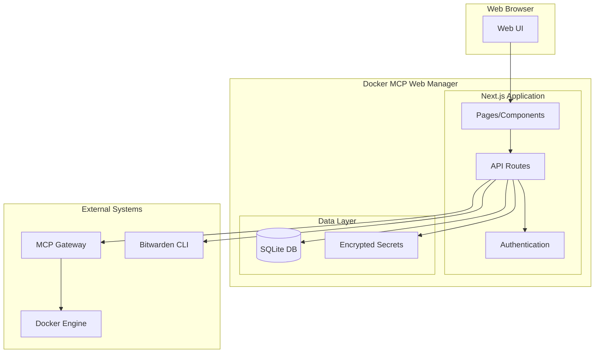

# Docker MCP Web Manager v2

Docker MCP (Model Context Protocol) サーバーの包括的な管理を提供するWebアプリケーションです。

## 概要

Docker MCP Web Manager v2は、MCPサーバーをDockerコンテナとして管理・監視・構成するためのNext.js製Webアプリケーションです。Docker MCP Gatewayと統合し、安全で効率的なコンテナ管理機能を提供します。

## 主要機能

- 🐳 **MCPサーバー管理**: Dockerコンテナベースのサーバー管理
- 🔐 **セキュリティファースト**: AES-256-GCM暗号化、認証・認可システム
- 📊 **リアルタイム監視**: サーバーステータス、ログ、メトリクス監視  
- 🔧 **設定管理**: サーバー設定とシークレット管理
- 🚀 **非同期ジョブ**: サーバー操作の非同期実行とべき等性保証
- 🛡️ **データ保護**: 自動データマスキングとプライバシー保護

## 技術スタック

- **フロントエンド**: Next.js 15.5.2, React 18, TypeScript 5.9, Tailwind CSS
- **バックエンド**: Next.js API Routes, NextAuth.js 4.24.11
- **データベース**: SQLite + Drizzle ORM 0.44.5
- **認証**: NextAuth.js with RBAC
- **暗号化**: Node.js crypto (AES-256-GCM)
- **コンテナ**: Docker + Docker Compose V2

## クイックスタート

### 前提条件

- Docker 20.10+
- Docker Compose V2
- Node.js 24.7.0+ (開発環境)

### インストール

1. **リポジトリのクローン**
```bash
git clone https://github.com/your-org/docker-mcp-web-manager-v2.git
cd docker-mcp-web-manager-v2
```

2. **環境変数の設定**
```bash
cp .env.example .env.local
```

環境変数を設定:
```bash
# NextAuth.js設定
NEXTAUTH_SECRET=your-32-character-secret-key
NEXTAUTH_URL=http://localhost:3000

# データベース設定
DATABASE_URL=file:./data/app.db

# 暗号化設定 (Base64エンコードされた32バイトキー)
ENCRYPTION_MASTER_KEY=$(node -e "console.log(require('crypto').randomBytes(32).toString('base64'))")
```

3. **Docker Composeで起動**
```bash
# 本番環境
docker compose -f docker-compose.prod.yml up -d

# 開発環境
npm install
npm run db:push
npm run dev
```

4. **アクセス**
ブラウザで http://localhost:3000 にアクセスして初期セットアップを完了してください。

## 開発

### 開発環境のセットアップ

```bash
# 依存関係のインストール
npm install

# データベースのセットアップ
npm run db:push
npm run db:seed

# 開発サーバー起動
npm run dev
```

### 利用可能なコマンド

```bash
# 開発・ビルド
npm run dev          # 開発サーバー起動
npm run build        # 本番ビルド
npm run start        # 本番サーバー起動

# テスト
npm run test         # ユニットテスト
npm run test:watch   # ウォッチモードテスト
npm run test:coverage # カバレッジ付きテスト
npm run test:integration # 統合テスト
npm run test:e2e     # E2Eテスト

# コード品質
npm run lint         # ESLint実行
npm run typecheck    # TypeScript型チェック

# データベース
npm run db:push      # マイグレーション実行
npm run db:seed      # 初期データ投入
```

## アーキテクチャ

### システム構成



### 主要コンポーネント

- **認証システム**: NextAuth.jsベースの認証、RBAC
- **暗号化システム**: AES-256-GCMによる機密データ保護
- **Docker統合**: MCP Gateway経由でのコンテナ管理
- **非同期ジョブ**: べき等性保証付きの非同期操作
- **データマスキング**: PII・機密データの自動マスキング

## セキュリティ

### セキュリティ機能

- **認証・認可**: NextAuth.js + RBAC
- **暗号化**: AES-256-GCMによるデータ暗号化
- **CSRF保護**: Synchronizer Token Pattern
- **レート制限**: IP・ユーザーベースの制限
- **CSP**: Content Security Policy実装
- **データマスキング**: 機密データの自動マスキング

### セキュリティベストプラクティス

- 非rootユーザーでの実行
- 最小権限の原則
- HTTPS強制
- セッションセキュリティ
- 入力検証とサニタイゼーション

## API仕様

### 主要エンドポイント

```bash
# サーバー管理
GET    /api/v1/servers          # サーバー一覧取得
POST   /api/v1/servers          # サーバー作成
GET    /api/v1/servers/:id      # サーバー詳細取得
PUT    /api/v1/servers/:id      # サーバー更新
DELETE /api/v1/servers/:id      # サーバー削除

# サーバー操作（非同期）
POST   /api/v1/servers/:id/start    # サーバー起動
POST   /api/v1/servers/:id/stop     # サーバー停止
POST   /api/v1/servers/:id/test     # ツールテスト

# ジョブ管理
GET    /api/v1/jobs/:id         # ジョブステータス取得

# ヘルスチェック
GET    /api/health              # アプリケーション健全性確認
```

### 非同期操作

サーバー操作は非同期で実行され、即座にジョブIDを返します：

```json
{
  "id": "uuid-string",
  "status": "pending",
  "message": "Operation started successfully",
  "estimatedDuration": 30000
}
```

## デプロイメント

### Docker Compose (推奨)

```bash
# 本番環境
docker compose -f docker-compose.prod.yml up -d

# ヘルスチェック
curl http://localhost:3000/api/health
```

### 環境変数

| 変数名 | 説明 | 必須 |
|--------|------|------|
| `NEXTAUTH_SECRET` | NextAuth.jsシークレットキー | ✅ |
| `NEXTAUTH_URL` | アプリケーションURL | ✅ |
| `DATABASE_URL` | データベースURL | ✅ |
| `ENCRYPTION_MASTER_KEY` | 暗号化マスターキー (Base64) | ✅ |
| `BITWARDEN_SERVER_URL` | BitwardenサーバーURL | ❌ |
| `LOG_LEVEL` | ログレベル (debug/info/error) | ❌ |

## 監視・運用

### ヘルスチェック

```bash
# アプリケーション健全性
curl http://localhost:3000/api/health

# レスポンス例
{
  "status": "healthy",
  "version": "1.0.0",
  "timestamp": "2024-01-01T00:00:00.000Z"
}
```

### ログ確認

```bash
# アプリケーションログ
docker compose logs -f web

# エラーログのみ
docker compose logs web | grep ERROR
```

## 貢献

### 開発参加

1. Issueを確認し、重複を避ける
2. リポジトリをフォーク
3. フィーチャーブランチを作成: `git checkout -b feature/amazing-feature`
4. 変更をコミット: `git commit -m 'Add amazing feature'`
5. プッシュ: `git push origin feature/amazing-feature`
6. プルリクエストを作成

### コード品質

コミット前に以下を実行してください：

```bash
npm run lint      # コード品質チェック
npm run typecheck # 型チェック  
npm run test      # テスト実行
```

## ライセンス

このプロジェクトはMITライセンスの下で公開されています。詳細は [LICENSE](LICENSE) ファイルを参照してください。

## サポート

- **Issues**: [GitHub Issues](https://github.com/your-org/docker-mcp-web-manager-v2/issues)
- **Discussions**: [GitHub Discussions](https://github.com/your-org/docker-mcp-web-manager-v2/discussions)
- **Documentation**: [docs/](./docs/)

## 関連リンク

- [API仕様書](./docs/api/README.md)
- [開発者ガイド](./docs/development/README.md)
- [セットアップガイド](./docs/setup/README.md)
- [アーキテクチャ概要](./.specs/design.md)
